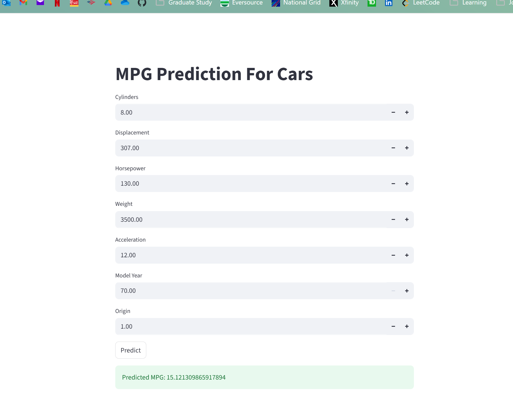
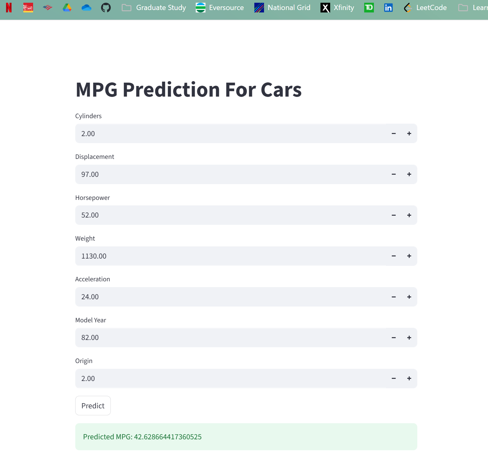
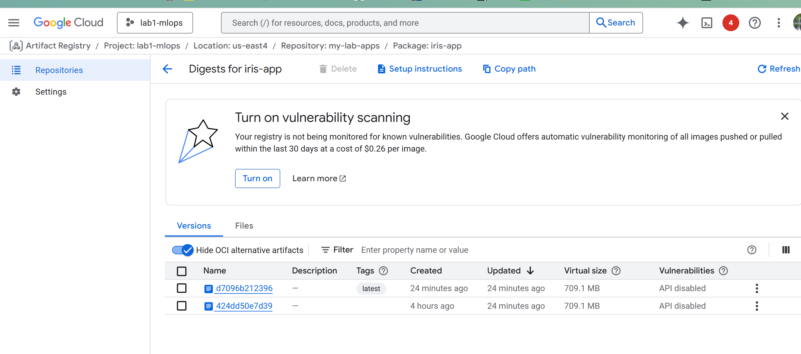

# Submission for Lab 1 (FLASK_GCP_LAB)  
## Modifications I performed:  
 - New Dataset [Auto MPG Dataset](https://archive.ics.uci.edu/dataset/9/auto+mpg)
 - Different Model (Linear Regression instead of logistic regression)  
 - Modified the Streamlit to account for different data

**Dificulties:** The greatest difficulty was the logistics of setting up GCP.  
I had difficult with understanding the artificat repository and actually building it.  
Also, the final link it generated required '/predict' in which I neglected to add. This caused  
me some errors for a while.  
  
All other code is the same.  
Examples of different output and proof the artificat is built on GCP below:  

Streamlit output example 1:    
  

Streamlit output example 2:    
 

Artifact in GCP   
  
